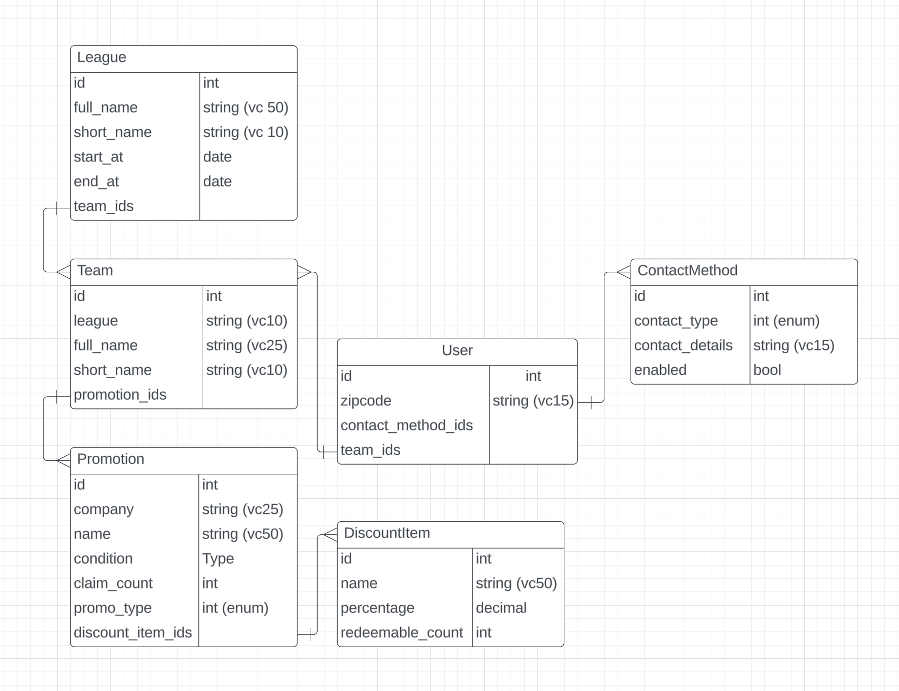

# README
notifiy users of local sports team deals with CRON jobs.
MVP: notify me of a free carwash from CBJ scoring.

Things you may want to cover:

* Ruby version
ruby 3.3.0

* System dependencies
- sendgrid api key

* Configuration
- rails master key

* Database creation

`psql -U zkolker -d deal_notifier_dev` to connect to local DB

* Database initialization
no seed yet

* How to run the test suite
`bundle exec rspec`

* Services (job queues, cache servers, search engines, etc.)

* Deployment instructions
run with ngrok for now...?
